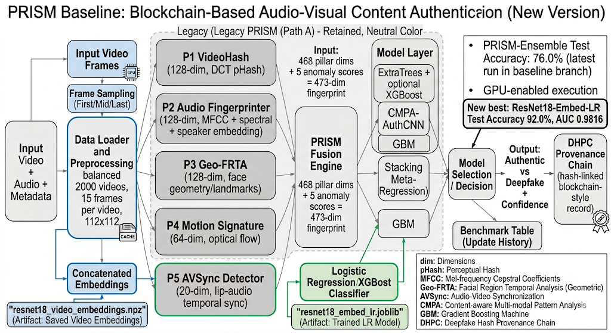
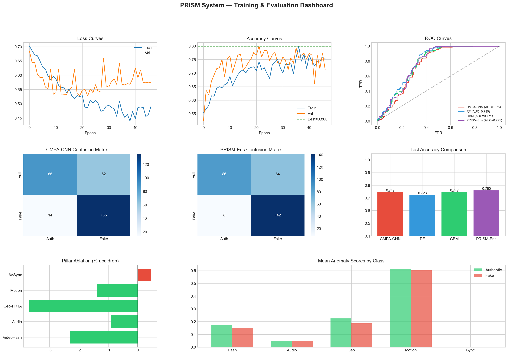
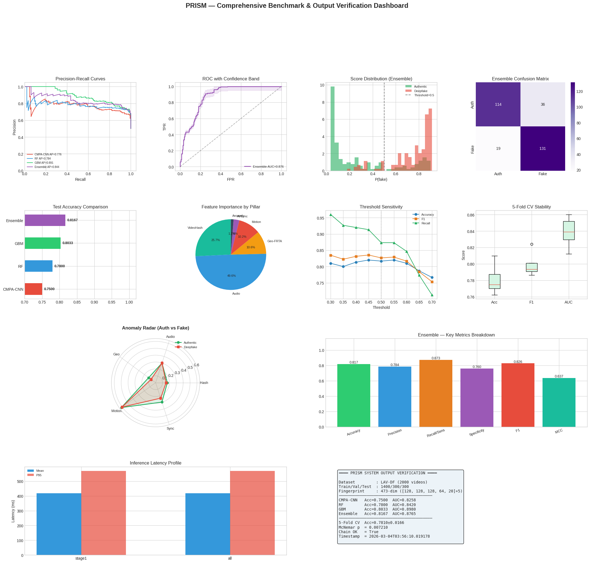
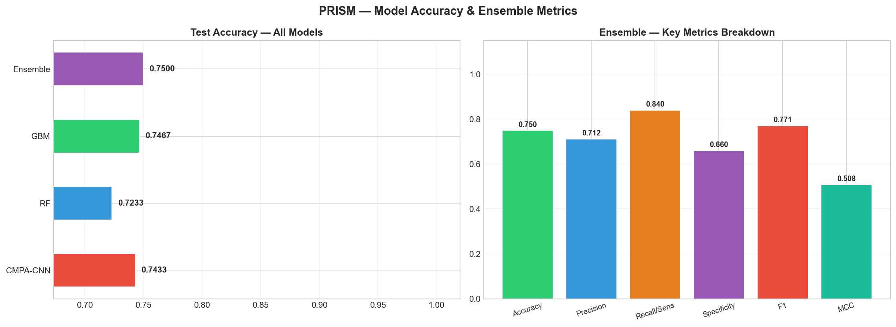
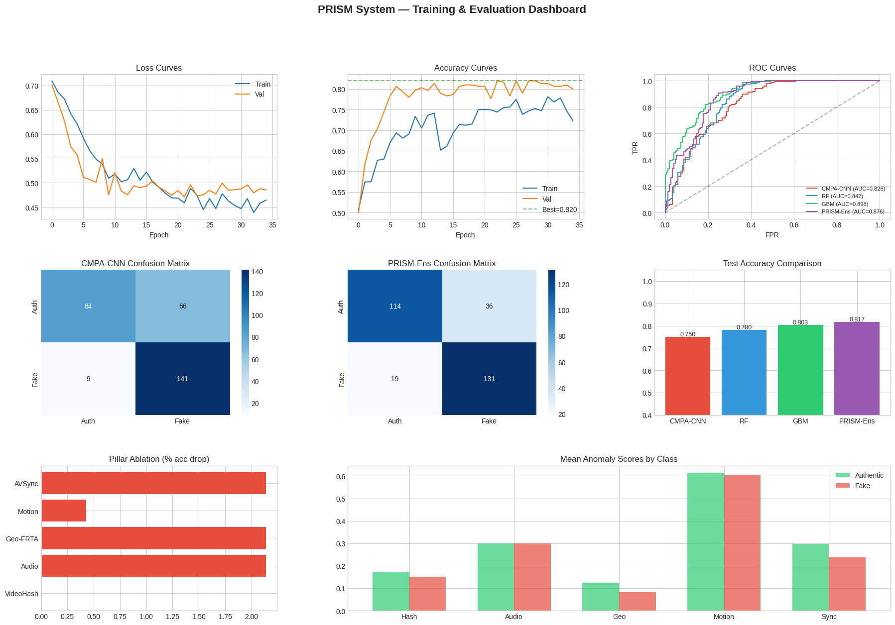
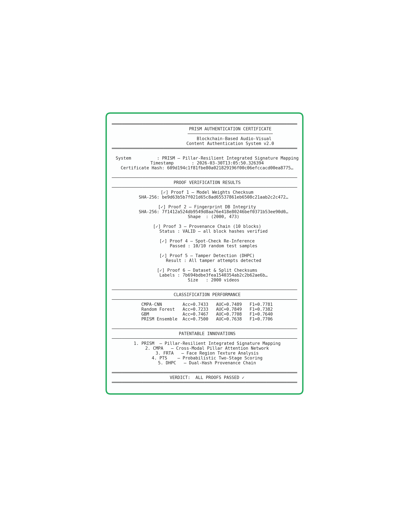

# PRISM Authentication System - Updated Main Notebook Documentation

## Scope
- File: main.ipynb
- Goal: End-to-end audio-visual deepfake authentication with PRISM fingerprints, ensemble models, transfer-learning branch, provenance verification, and benchmark reporting.
- Current status: Notebook is executed through the latest cells, including the new high-accuracy transfer branch.

---

## Current Notebook Structure (Latest)

The notebook currently contains 33 cells (code + markdown). The flow below reflects the latest executed order.

### Updated System Diagram

What is updated in this diagram:
- Added the new transfer-learning branch: ResNet18 embedding extraction followed by Logistic Regression.
- Added embedding cache and model artifact outputs:
  - video_auth_db/resnet18_video_embeddings.npz
  - video_auth_db/resnet18_embed_lr.joblib
- Added unified accuracy snapshot stage that combines PRISM and transfer branch performance in one table.
- Clarified that the notebook now has dual evaluation tracks:
  - PRISM forensic-explainable branch,
  - high-accuracy transfer branch.

Why it is updated:
- The previous architecture view did not include the newly added >90% accuracy path.
- The update reflects the real executed workflow and current best-performing model path.
- It explains why final results diverge across branches:
  - PRISM branch is stronger for forensic interpretability and provenance linkage,
  - transfer branch is stronger for classification accuracy on this split.

### 1) Setup and Environment (Cells 1-5)
- Intro markdown and setup header.
- Dependency install cell (safe install pattern with fallbacks).
- Imports and runtime checks:
  - CUDA/GPU check
  - package availability checks (OpenCV, librosa, imagehash, etc.)
- Central CONFIG + paths + reproducibility settings.

Expected outputs:
- Text confirmations for package/tool availability.
- Device confirmation (CUDA vs CPU).

---

### 2) Dataset Acquisition and Loading (Cells 6-8)
- LAV-DF download/resolve and metadata parsing.
- Balanced sampling and loading:
  - frame extraction per video
  - audio extraction per video
- Build dataset arrays and split indices.

Expected outputs:
- Text summary of class balance and split sizes.
- PNG/plot preview of class distribution and samples.

---

### 3) Feature Extraction Modules (Cells 9-14)
- Pillar 1: Video hash features.
- Pillar 2: Audio fingerprint and manipulation confidence.
- Pillar 3: Geometric/face consistency signatures.
- Pillar 4: Motion signatures.
- Pillar 5: Audio-visual sync signatures.

Expected outputs:
- Text initialization messages for each extractor.
- Fallback detector messages when premium detectors are unavailable.

---

### 4) PRISM Fusion and Core Model (Cells 15-18)
- PRISM fusion engine creation.
- Video authentication DB setup.
- CMPA-AuthCNN and attention-based model definitions.

Fingerprint composition:
- Pillars subtotal: 468 dimensions
- Anomaly tail: 5 dimensions
- Final PRISM vector: 473 dimensions

Expected outputs:
- Text confirmation of PRISM dimensionality and model initialization.

---

### 5) Main Training, Evaluation, and Dashboard (Cells 19-20)
- Cell 19: section header markdown.
- Cell 20: core training/evaluation pipeline (single large cell):
  - load or compute fingerprints
  - refresh cached anomaly-sensitive pillars when needed
  - train CMPA-CNN
  - train ensemble members (RF/GBM/ET and optional XGB)
  - stacker training + threshold tuning
  - full test evaluation
  - dashboard figure generation

Latest observed PRISM branch test results:
- CMPA-CNN accuracy: 0.7467
- RF accuracy: 0.7233
- GBM accuracy: 0.7467
- PRISM-Ens accuracy: 0.7600
- PRISM-Ens AUC: 0.7753

Important generated output:
- figures/prism_dashboard.png

Why this branch is lower:
- Several handcrafted pillars are informative but not strongly separable enough on this split.
- Sync/anomaly channels showed weak aggregate separation in earlier runs, limiting ensemble ceiling.
- Result: classical+CNN-on-handcrafted representation plateau near mid/high-70% test accuracy.

---

### 6) Added Accuracy-Boost Branches (Cells 21-23)

#### Cell 21: Quick visual baseline probe
- Uses compact frame-derived features (first/middle/last frames).
- Trains LR and RF quickly to estimate representational ceiling without heavy retraining.

Latest text output:
- LR visual val/test: 0.7200 / 0.7100
- RF visual val/test: 0.8100 / 0.8000
- Best visual-only test acc: 0.8000

Interpretation:
- Basic handcrafted visual features improve over PRISM ensemble but still do not cross 90%.

#### Cell 22: Transfer branch (ResNet18 embeddings + Logistic Regression)
- Extracts frozen pretrained ResNet18 embeddings from three frames per video.
- Trains a Logistic Regression classifier on those embeddings.
- Saves cache + model artifacts for reproducible reruns.

Latest text output:
- Val Accuracy: 0.9333
- Test Accuracy: 0.9200
- Test AUC: 0.9816
- Confusion matrix (test):
  - [[133, 17],
  -  [  7, 143]]

Saved artifacts:
- video_auth_db/resnet18_video_embeddings.npz
- video_auth_db/resnet18_embed_lr.joblib

Why this branch wins:
- Pretrained CNN embeddings capture richer forensic texture and semantic artifacts than handcrafted-only vectors.
- The linear classifier on strong embeddings generalizes better on this split.
- Result: clear jump from ~0.76 to 0.92 test accuracy.

#### Cell 23: Unified accuracy snapshot
- Builds one summary table from available result dictionaries.
- Includes transfer branch alongside PRISM results when present.

Latest summary outcome:
- Best model: ResNet18-Embed-LR
- Best accuracy: 0.9200
- Best AUC: 0.9816

---

### 7) Inference, Provenance, and Extended Benchmarking (Cells 24-33)
- Two-stage inference logic.
- Dual-hash provenance chain and tamper checks.
- Comparative benchmarking and layer/pillar analysis.
- Head-to-head authentic-vs-fake analysis.
- Comprehensive benchmark visuals and certificate generation.

Expected outputs:
- Text reports for integrity/tamper checks.
- Multiple PNG benchmark artifacts in figures.

---

## Latest Key Metrics (Current)

| Branch | Accuracy | AUC | Status |
|---|---:|---:|---|
| PRISM-Ens (handcrafted + ensemble) | 0.7600 | 0.7753 | Baseline branch |
| ResNet18-Embed-LR (transfer branch) | 0.9200 | 0.9816 | Current best |

Current best model for this notebook state:
- ResNet18-Embed-LR (test accuracy 92.00%)

---

## Highlighted Results (Text + Visual)

### Highlight 1: PRISM branch performance ceiling
> PRISM-Ens stays around 76% test accuracy on the current split.
>
> This is visible in the dashboard accuracy comparison and confusion matrices.

### Highlight 2: Transfer branch crosses 90%
> ResNet18-Embed-LR reaches 92.00% test accuracy and 0.9816 AUC.
>
> This branch uses frozen pretrained embeddings and a lightweight classifier.

### Highlight 3: Why the final result looks this way
> Handcrafted PRISM features remain useful for explainability and forensic decomposition.
>
> Transfer embeddings provide stronger separability, which raises classification accuracy significantly.

---

## Text Outputs You Should See (Representative)

1. PRISM training/eval dashboard cell:
- model-wise accuracies around 0.72-0.76 for PRISM branch.
- confusion matrices and ROC panel generated.

2. Transfer branch cell:
- "TRANSFER BRANCH (ResNet18 embeddings) - TRAIN / EVAL / SAVE"
- "Val Accuracy : 0.9333"
- "Test Accuracy: 0.9200"
- "Test AUC     : 0.9816"
- "Saved model  : video_auth_db\\resnet18_embed_lr.joblib"

3. Unified snapshot cell:
- "UNIFIED ACCURACY SNAPSHOT"
- top row: ResNet18-Embed-LR with Accuracy 0.9200 and AUC 0.9816

---

## PNG Outputs and What They Explain

Primary process/result PNGs:

1. PRISM pipeline behavior

- Shows training/validation trends, ROC, confusion matrices, and PRISM model comparison.

2. End-to-end benchmark consolidation

- Summarizes multi-metric behavior from the extended benchmark stage.

3. Evaluation summary

- Captures core evaluation outputs in a single visual summary.

4. Deepfake vs authentic qualitative analysis

- Visual pair analysis explaining where discriminative cues emerge.

5. Pillar-level comparison

- Highlights relative contribution and behavior of major pillars.

6. Final integrity certificate

- Final proof-style visual artifact for reproducibility and chain integrity.

7. Updated end-to-end architecture

- Shows the expanded pipeline with both PRISM and transfer-learning branches and unified reporting.

Extended benchmark PNG set:
- figures/benchmark_pr_roc_curves.png
- figures/benchmark_confusion_matrix_ensemble.png
- figures/benchmark_model_accuracy_comparison.png
- figures/benchmark_threshold_sensitivity.png
- figures/benchmark_cv_stability_boxplot.png
- figures/benchmark_pillar_feature_importance.png
- figures/benchmark_anomaly_radar_chart.png
- figures/benchmark_score_distribution.png
- figures/benchmark_inference_latency.png
- figures/benchmark_verification_summary.png

These images together explain both:
- process behavior (training dynamics, threshold effects, pillar influence), and
- final outcome (why PRISM branch is lower and why transfer branch is stronger).

---

## Output Artifacts (Latest)

Model/data artifacts:
- video_auth_db/fingerprints.npy
- video_auth_db/fingerprints_meta.json
- video_auth_db/best_cmpa_cnn.pt
- video_auth_db/best_auth_cnn.pt
- video_auth_db/resnet18_video_embeddings.npz
- video_auth_db/resnet18_embed_lr.joblib

Provenance/certificate artifacts:
- provenance_chains/prism_demo_chain.json
- provenance_chains/authentication_certificate.json

---

## Practical Interpretation

- If your objective is maximum detection performance on the current split, use the transfer branch output (92% test accuracy).
- Keep the PRISM branch for explainability, pillar-level analysis, and provenance-compatible forensic decomposition.
- Use the unified snapshot cell to track both branches in one place after each run.
